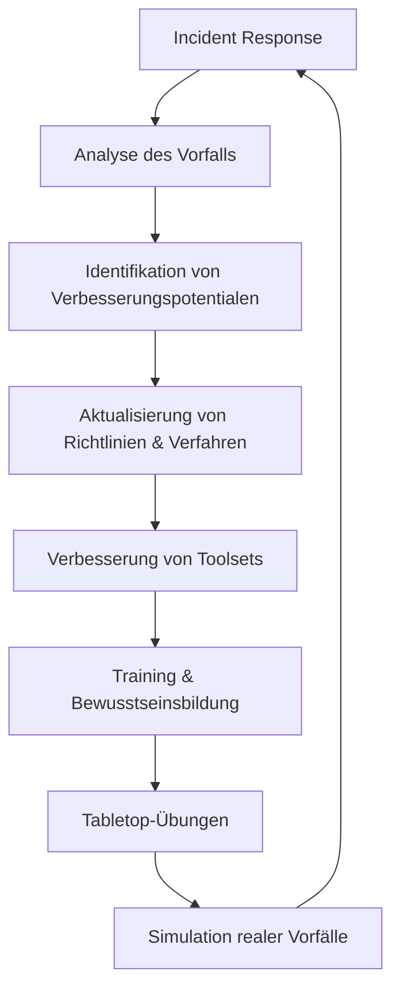

# Incident Response

> [!INFO]
> Incident Response (IR) umfasst die strukturierte Methodik zur Erkennung, Analyse und Bewältigung von Sicherheitsvorfällen in IT-Umgebungen. Ein gut definierter IR-Prozess minimiert Schäden, reduziert Wiederherstellungskosten und verbessert die Sicherheitslage.

## 📋 Incident Response-Grundlagen

### Der IR-Lebenszyklus (PICERL)

Der IR-Lebenszyklus nach NIST SP 800-61 besteht aus sechs Phasen:

```
┌──────────────────────────────────────────────────────────────────┐
│                    Incident Response Lifecycle                   │
├────────────┬────────────┬────────────┬───────────┬───────────────┤
│ Preparation│ Identific. │ Containment│ Eradic.   │ Recovery      │
│            │            │            │           │ & Lessons L.  │
└────────────┴────────────┴────────────┴───────────┴───────────────┘
```

1. **Preparation**: Vorbereitung der Organisation auf Vorfälle
2. **Identification**: Erkennen und Bestätigen eines Sicherheitsvorfalls
3. **Containment**: Eindämmung des Vorfalls zur Schadensbegrenzung
4. **Eradication**: Beseitigung der Ursachen des Vorfalls
5. **Recovery**: Wiederherstellung betroffener Systeme
6. **Lessons Learned**: Auswertung und Verbesserung

### Incident-Kategorien

| Kategorie | Beschreibung | Beispiele |
|-----------|--------------|-----------|
| Malware | Schädliche Software | Ransomware, Trojaner, Würmer |
| Unauthorized Access | Unbefugter Zugriff | Account-Kompromittierung, Privilege Escalation |
| Denial of Service | Dienstverweigerung | DDoS-Angriffe, Ressourcenerschöpfung |
| Data Breach | Datenverletzung | Exfiltration sensibler Daten |
| Insider Threat | Bedrohung von innen | Datenmissbrauch durch Mitarbeiter |
| Web Application | Angriffe auf Web-Apps | SQL-Injection, XSS, CSRF |
| Physical | Physische Sicherheit | Geräte-Diebstahl, Unbefugter Zutritt |
| Social Engineering | Manipulation | Phishing, Pretexting, Baiting |

### Incident-Klassifizierung

Die Klassifizierung von Vorfällen nach Schweregrad hilft bei der Priorisierung:

```
┌────────────────────────────────────────────────────────────┐
│               Incident Severity Levels                     │
├──────────┬───────────────────────┬────────────────────────┤
│ Kritisch │ • Geschäftskritische  │ • Sofortige Reaktion   │
│          │   Systeme betroffen   │ • 24/7-Bearbeitung     │
│          │ • Umfangreiche Daten- │ • Management-Eskalation│
│          │   kompromittierung    │ • All-Hands-Response   │
├──────────┼───────────────────────┼────────────────────────┤
│ Hoch     │ • Wichtige Systeme    │ • Reaktion <4 Stunden  │
│          │   beeinträchtigt      │ • Prioritäres Handling │
│          │ • Begrenzte Daten-    │ • Team-Mobilisierung   │
│          │   offenlegung         │                        │
├──────────┼───────────────────────┼────────────────────────┤
│ Mittel   │ • Einzelne Systeme    │ • Reaktion <24 Stunden │
│          │   betroffen           │ • Während Arbeitszeit  │
│          │ • Keine kritischen    │ • Standard-Verfahren   │
│          │   Daten kompromittiert│                        │
├──────────┼───────────────────────┼────────────────────────┤
│ Niedrig  │ • Minimale Auswirkung │ • Reaktion <1 Woche    │
│          │ • Keine sensiblen     │ • Einfache Maßnahmen   │
│          │   Daten betroffen     │ • Dokumentation        │
└──────────┴───────────────────────┴────────────────────────┘
```

## 🔎 Vorbereitung (Preparation)

### IR-Team-Struktur

```
┌───────────────────────────────────────────────────────────┐
│                   Incident Response Team                  │
├───────────────┬───────────────┬───────────────────────────┤
│ IR Manager    │ IR Analysts   │ Extended Team             │
├───────────────┼───────────────┼───────────────────────────┤
│• Koordination │• Untersuchung │• IT-Operations            │
│• Management-  │• Forensik     │• Netzwerk-Team            │
│  Reporting    │• Malware-     │• Rechtsabteilung          │
│• Eskalation   │  Analyse      │• PR/Kommunikation         │
│• Entscheidung │• Containment  │• Datenschutzbeauftragter  │
└───────────────┴───────────────┴───────────────────────────┘
```

### IR-Playbooks

Playbooks sind vorbereitete Ablaufpläne für bestimmte Vorfallsarten:

```yaml
# Beispiel: Ransomware-Response-Playbook
name: "Ransomware Incident Response"
severity: "Critical"
owner: "Incident Response Team"
version: "1.2"

phases:
  - name: "Identification"
    tasks:
      - "Bestätigung des Ransomware-Vorfalls"
      - "Identifikation betroffener Systeme"
      - "Erfassung von Ransomware-IOCs"
      - "Meldung an Management und Rechtsabteilung"
      
  - name: "Containment"
    tasks:
      - "Isolierung betroffener Systeme vom Netzwerk"
      - "Sicherung forensischer Beweise"
      - "Überprüfung von Backups auf Integrität"
      - "Blockieren bekannter IOCs auf Netzwerkebene"
      
  - name: "Eradication"
    tasks:
      - "Malware-Analyse (wenn möglich)"
      - "Identifikation des Infektionsvektors"
      - "Überprüfung weiterer Systeme auf Kompromittierung"
      
  - name: "Recovery"
    tasks:
      - "Wiederherstellung aus gesicherten Backups"
      - "Saubere Neuinstallation betroffener Systeme"
      - "Passwort-Reset für alle Accounts"
      - "Sicherheitsupdates aller Systeme"
      
  - name: "Lessons Learned"
    tasks:
      - "Post-Incident-Analyse"
      - "Dokumentation des Vorfalls"
      - "Aktualisierung der Sicherheitsrichtlinien"
      - "Schulung der Mitarbeiter"

indicators:
  - type: "file"
    value: "*.encrypted, ransom_note.txt"
  - type: "process"
    value: "ransomware.exe, encrypt.exe"
  - type: "registry"
    value: "HKCU\\Software\\Ransomware"
```

### Necessary Tools

Ein gut ausgestattetes IR-Team benötigt verschiedene Tools:

**Forensik-Tools**:
- **Disk-Imaging**: FTK Imager, dd
- **Memory-Forensik**: Volatility, Rekall
- **Netzwerk-Forensik**: Wireshark, NetworkMiner
- **Timeline-Analyse**: Autopsy, log2timeline/Plaso

**Malware-Analyse**:
- **Statische Analyse**: IDA Pro, Ghidra, PEStudio
- **Dynamische Analyse**: Sandboxen (Cuckoo, ANY.RUN, VMRay)
- **Verhaltensanalyse**: Procmon, Process Explorer

**IR-Plattformen**:
- **SOAR**: IBM Resilient, Swimlane, Splunk Phantom
- **Fallmanagement**: TheHive, RTIR
- **Automatisierung**: Demisto, Shuffle, n8n

## 🔍 Erkennung (Identification)

### Alarme und Indikatoren

Die Erkennung erfolgt über verschiedene Quellen:

```bash
# SIEM-Abfrage für verdächtige PowerShell-Aktivitäten
index=windows sourcetype=WinEventLog:Security (EventCode=4688 OR EventCode=4104) AND (CommandLine="*-enc*" OR CommandLine="*hidden*" OR CommandLine="*bypass*") 
| table _time ComputerName User CommandLine

# Linux-Befehl zur Überprüfung auf ungewöhnliche SUID-Binaries
find / -perm -4000 -type f -exec ls -la {} \; 2>/dev/null | sort

# Suche nach IoCs in Netzwerkverkehr
grep -E "evil\.com|185\.92\.220\.35|7e5e73a83da8eb26cf498a22613f3d57" /var/log/proxy/access.log
```

**Typische Erkennungsquellen**:
- SIEM-Alarme und -Korrelationen
- EDR/XDR-Alerts (Endpoint Detection & Response)
- Firewall- und IDS/IPS-Alarme
- Cloud-Security-Benachrichtigungen
- Benutzerberichte über Anomalien
- Threat Hunting-Ergebnisse
- Threat Intelligence-Feeds

### Initial Triage

Die Erstbewertung eines Vorfalls folgt einem strukturierten Prozess:

1. **Alarmvalidierung**: Überprüfen, ob es sich um einen tatsächlichen Sicherheitsvorfall handelt
2. **Umfangsbestimmung**: Erste Einschätzung der betroffenen Systeme
3. **Schweregrad-Einstufung**: Klassifizierung des Vorfalls nach Schweregrad
4. **Dringlichkeitsbewertung**: Festlegung des erforderlichen Reaktionstempos
5. **Ressourcenzuweisung**: Zuordnung von Personal und Werkzeugen

### Dokumentation

Die Dokumentation eines Vorfalls sollte folgende Informationen enthalten:

```
# Incident Documentation Template
## Incident Overview
- Incident ID: IR-2025-042
- Date/Time Detected: 2025-04-28 14:32 UTC
- Detected By: SIEM Alert (Alert ID: A12345)
- Classification: Unauthorized Access
- Severity: High
- Status: In Progress
- Assigned To: Jane Doe

## Affected Systems
- web01.example.com (192.168.1.45)
- app02.example.com (192.168.1.67)

## Timeline of Events
- 2025-04-28 13:45 UTC: Initial suspicious login from IP 203.0.113.42
- 2025-04-28 13:52 UTC: Privilege escalation attempt on web01
- 2025-04-28 14:05 UTC: Lateral movement to app02
- 2025-04-28 14:32 UTC: SIEM alert triggered

## Evidence Collected
- Authentication logs from web01 (/var/log/auth.log)
- Memory dump from app02 (app02-mem.raw)
- Network capture (incident-042.pcap)

## Actions Taken
- Isolated affected systems from network
- Initiated memory and disk acquisition
- Blocked source IP at firewall
```

## 🛡️ Eindämmung (Containment)

### Kurzfristige Eindämmung

Sofortige Maßnahmen zur Begrenzung der Ausbreitung:

```bash
# Netzwerk-Isolation eines kompromittierten Linux-Servers
ip link set eth0 down

# Windows-Host von Domain isolieren
netsh advfirewall set allprofiles state on
netsh advfirewall firewall add rule name="INCIDENT: Block All" dir=in action=block enable=yes
netsh advfirewall firewall add rule name="INCIDENT: Block All" dir=out action=block enable=yes

# Kompromittiertes AWS-System isolieren
aws ec2 modify-instance-attribute --instance-id i-1234567890abcdef0 --groups sg-incident-isolation
```

**Best Practices:**
- Isolation vor Notabschaltung bevorzugen (für forensische Daten)
- Priorisierung kritischer Systeme
- Umsichtige Blockierung von Netzwerkverkehr
- Temporäre Accounts deaktivieren
- Zweite Kommunikationskanäle nutzen

### Langfristige Eindämmung

Strategische Maßnahmen zur Verhinderung der Wiederholung:

```bash
# Umsetzung einer strikten Firewall-Segmentierung
iptables -A FORWARD -s 10.0.0.0/24 -d 10.1.0.0/24 -j DROP

# Einrichten von Splunk-Suchen für bekannte IOCs
index=* (sourcetype=linux_secure OR sourcetype=wineventlog) 
  (src_ip="203.0.113.42" OR CommandLine="*evil-script.ps1*" OR dest_port=4444)
  | stats count by host, source, dest

# Implementierung von Host-Isolierungsautomatisierung
# Beispiel: Terraform-Code für AWS-Quarantäne-Sicherheitsgruppen
resource "aws_security_group" "quarantine" {
  name        = "quarantine"
  description = "Quarantine security group for compromised instances"
  vpc_id      = aws_vpc.main.id
  
  egress {
    from_port   = 443
    to_port     = 443
    protocol    = "tcp"
    cidr_blocks = ["10.0.0.5/32"]  # Nur Logging-Server
  }
}
```

**Best Practices:**
- Implementierung von Netzwerksegmentierung
- Erweiterte Logging-Konfigurationen
- Erhöhung der Monitoring-Dichte
- Reduzierung der Angriffsfläche
- Strikte Zugriffskontrollen

### Beweissicherung

Die ordnungsgemäße Beweissicherung ist entscheidend:

```bash
# Erstellung eines forensischen Disk-Images
sudo dd if=/dev/sda of=/mnt/evidence/sda.img bs=512 status=progress

# Erfassung des Arbeitsspeichers
sudo lime-linux -d /mnt/evidence/memory.lime

# Erstellung einer Chain of Custody-Dokumentation
# Beispiel für ein Chain of Custody-Formular
# ---------------------------------------------
# Evidence ID: E2025-042-001
# Description: Hard drive from web01.example.com
# Collected by: John Smith
# Date/Time: 2025-04-28 15:45 UTC
# Location: Datacenter Frankfurt, Rack A12
# ---------------------------------------------
# Hash values: 
# MD5: a1b2c3d4e5f6g7h8i9j0k1l2m3n4o5p6
# SHA256: a1b2c3d4e5f6g7h8i9j0k1l2m3n4o5p6a1b2c3d4e5f6g7h8i9j0k1l2m3n4o5p6
# ---------------------------------------------
# Custody Transfers:
# From: John Smith    To: Jane Doe    Date: 2025-04-28 16:30 UTC
# ---------------------------------------------
```

**Best Practices:**
- Verwendung schreibgeschützter Tools
- Erstellung forensischer Kopien
- Dokumentation der Beweiskette (Chain of Custody)
- Sichere Aufbewahrung von Beweismitteln
- Einhaltung rechtlicher Anforderungen

## 🧹 Beseitigung (Eradication)

### Root-Cause-Analysis

Die Identifizierung der Ursache ist entscheidend für die vollständige Beseitigung:

```
# Root Cause Analysis Template
## Incident Details
- Incident ID: IR-2025-042
- Type: Unauthorized Access

## Attack Vector Analysis
- Initial Access: Phishing-E-Mail mit bösartigem Anhang
- Exploitation: Ausnutzung einer Makro-Schwachstelle in Office-Dokument
- Privilege Escalation: Ausnutzung eines ungepatchten lokalen Privilege Escalation-Fehlers
- Persistence: Scheduled Task und Registry Run Key
- Lateral Movement: Verwendung gespeicherter Anmeldeinformationen in LSASS

## Vulnerability Assessment
- Missing Patches: CVE-2025-12345 nicht gepatcht auf betroffenen Systemen
- Configuration Issues: Makros global aktiviert
- Security Controls Gap: Fehlende Anwendungs-Whitelisting
- Process Deficiencies: Unzureichendes Patch-Management

## Timeline Reconstruction
[Detaillierte Zeitachse des Angriffs]

## Attribution
- Known Threat Actor: APT-123
- Campaign: "FinStealer"
- Motivation: Wirtschaftsspionage
```

### Malware-Analyse

```bash
# Grundlegende statische Analyse
file malware_sample.exe
strings malware_sample.exe | grep -E "http|\.com|\.net|pass|user"
pe-sieve64.exe --pid 1234 --dump

# Grundlegende dynamische Analyse
procmon /backingfile:malware_analysis.pml /quiet /minimized
echo "127.0.0.1 evil-domain.com" >> C:\Windows\System32\drivers\etc\hosts
```

**Fortgeschrittene Analysetechniken:**
- Reverse Engineering mit IDA Pro/Ghidra
- Sandbox-Analyse (ANY.RUN, Cuckoo)
- Memory Forensics mit Volatility
- Netzwerkverkehrsanalyse mit Wireshark

### Clean-Up-Prozess

```bash
# Persistenz-Mechanismen entfernen (Windows)
schtasks /delete /tn "MaliciousTask" /f
reg delete "HKCU\Software\Microsoft\Windows\CurrentVersion\Run" /v "MaliciousKey" /f

# Backdoor-Benutzer entfernen (Linux)
userdel -r backdoor_user

# Betroffene Dateien entfernen
find /var/www -name "*.php" -type f -exec grep -l "backdoor_code" {} \; -exec rm -f {} \;

# Malware-Quarantäne und Analyse
zip -e -P infected evidence/malware/infected_file.exe
mv evidence/malware /opt/malware_quarantine/
```

**Best Practices:**
- Systematisches Entfernen aller Persistenzmechanismen
- Überprüfung aller potenziell kompromittierten Systeme
- Validierung der Beseitigung durch Sicherheitsscans
- Quarantäne von Malware für weitere Analyse
- Dokumentation aller Beseitigungsmaßnahmen

## 🔄 Wiederherstellung (Recovery)

### System-Wiederherstellung

```bash
# Wiederherstellung aus Backup (Linux)
rsync -avz --progress backup_server:/backups/2025-04-26/web01/ /

# Wiederherstellung aus Snapshot (AWS)
aws ec2 create-image \
  --instance-id i-1234567890abcdef0 \
  --name "Pre-incident-AMI" \
  --description "AMI created before security incident"

aws ec2 run-instances \
  --image-id ami-0abcdef1234567890 \
  --instance-type t3.large \
  --key-name my-key-pair \
  --security-group-ids sg-903004f8

# Wiederherstellung einer Azure VM aus Backup
az backup restore restore-disks \
  --resource-group myResourceGroup \
  --vault-name myRecoveryServicesVault \
  --container-name myVM \
  --item-name myVM \
  --restore-mode original \
  --target-resource-group targetRG
```

**Best Practices:**
- Validierung der Integrität von Backups vor der Wiederherstellung
- Schrittweise Wiederherstellung kritischer Systeme
- Parallele Systeme während der Übergangsphase
- Erhöhtes Monitoring während der Wiederherstellung
- Testen der wiederhergestellten Systeme vor Produktivschaltung

### Sicherheitshärtung

```bash
# Härtung eines Linux-Webservers nach Kompromittierung
# Aktualisieren aller Pakete
apt update && apt upgrade -y

# Minimieren der Angriffsfläche
apt autoremove -y
apt purge -y telnet ftp

# Konfiguration des SSH-Servers
sed -i 's/#PermitRootLogin yes/PermitRootLogin no/' /etc/ssh/sshd_config
sed -i 's/X11Forwarding yes/X11Forwarding no/' /etc/ssh/sshd_config
systemctl restart sshd

# Firewall-Konfiguration
ufw default deny incoming
ufw default allow outgoing
ufw allow ssh
ufw allow http
ufw allow https
ufw enable
```

**Best Practices:**
- Patchen aller bekannten Schwachstellen
- Implementierung des Least-Privilege-Prinzips
- Härtung nach Industriestandards (CIS Benchmarks)
- Entfernung nicht benötigter Software und Dienste
- Implementierung von Multi-Faktor-Authentifizierung
- Network Segmentation und Mikrosegmentierung

### Normalisierungsprozess

```
# Return to Operations Checklist
## Voraussetzungen für die Produktivschaltung
- [ ] Alle kritischen Patches installiert
- [ ] Sicherheitskontrollen validiert
- [ ] Monitoring aktiv
- [ ] Backups eingerichtet
- [ ] Dokumentation aktualisiert

## Stufenweise Wiederinbetriebnahme
1. [ ] Interne Testsysteme
2. [ ] Back-Office-Systeme
3. [ ] Interne Anwendersysteme
4. [ ] Kundensysteme

## Validierungstests
- [ ] Funktionalitätstests durchgeführt
- [ ] Sicherheitstests durchgeführt
- [ ] Performance-Tests durchgeführt
- [ ] Compliance-Checks durchgeführt

## Kommunikation
- [ ] Internes Update an Mitarbeiter
- [ ] Statusbericht an Management
- [ ] Mitteilung an betroffene Kunden
- [ ] Abschlussbericht vorbereitet
```

## 📝 Lessons Learned

### Post-Incident-Analyse

```
# Post-Incident Analysis Template
## Incident Overview
- Incident ID: IR-2025-042
- Duration: 72 Stunden
- Impact: 15 Server, 3 Datenbanken, 2 Geschäftsanwendungen

## What Went Well
- Schnelle Erkennung durch SOC-Team (< 30 Min)
- Effektive Teamkommunikation über dedizierte Kanäle
- Erfolgreiche Containment-Strategie verhinderte weitere Ausbreitung

## What Could Be Improved
- Verzögerungen bei initialer Eskalation (45 Min)
- Fehlende automatisierte Isolation-Möglichkeiten
- Mangelnde Klarheit über Entscheidungsbefugnisse
- Unvollständige Asset-Inventarisierung verzögerte Scope-Definition

## Root Causes
- Ungepatche Vulnerability (CVE-2025-12345)
- Fehlendes MFA für Admin-Accounts
- Übermäßige Berechtigungen für Service-Accounts

## Action Items
- Patch-Management-Prozess überarbeiten (Verantwortlich: IT-Ops, Frist: 30 Tage)
- MFA für alle privilegierten Accounts implementieren (Verantwortlich: IAM-Team, Frist: 14 Tage)
- Automatisierte Isolation-Playbooks entwickeln (Verantwortlich: SOC, Frist: 60 Tage)
- Regelmäßige IR-Übungen durchführen (Verantwortlich: CISO, Frist: Quartalsweise)
```

### IR-Prozessverbesserung



**Best Practices:**
- Regelmäßige Überprüfung und Aktualisierung von IR-Plänen
- Implementierung von Feedback-Loops
- Entwicklung von Metriken zur IR-Effektivität
- Purple Team-Übungen zur Validierung von IR-Verbesserungen
- Benchmarking gegen Industriestandards

### Berichterstattung

```
# Executive Summary Template
## Incident Overview
[Kurze, nicht-technische Beschreibung des Vorfalls]

## Business Impact
- Ausfallzeiten: 8 Stunden für Kundensysteme
- Finanzieller Schaden: Geschätzt 45.000 € (direkte Kosten)
- Betroffene Kunden: 120
- Reputationsschaden: Minimal (keine öffentliche Bekanntgabe)

## Root Cause
[Grundlegende Ursachenbeschreibung ohne technische Details]

## Response Effectiveness
- Mean Time to Detect (MTTD): 30 Minuten
- Mean Time to Contain (MTTC): 2 Stunden
- Mean Time to Recover (MTTR): 12 Stunden

## Key Recommendations
1. [Top-Empfehlung mit Business-Bezug]
2. [Zweite Empfehlung mit Business-Bezug]
3. [Dritte Empfehlung mit Business-Bezug]

## Resource Requirements
[Benötigte Ressourcen zur Umsetzung der Empfehlungen]
```

## 🔄 Automation und Tools

### SOAR-Integration

```yaml
# SOAR-Playbook für Phishing-Vorfälle (Pseudo-YAML)
name: "Phishing Email Response"
triggers:
  - source: "Email Security Gateway"
    conditions:
      - field: "alert.category"
        value: "phishing"
      - field: "alert.confidence"
        value: "> 70"
        
actions:
  - name: "Extract IOCs from Email"
    type: "email_analyzer"
    parameters:
      target: "{{alert.attachment}}"
      extract: ["urls", "attachments", "sender"]
      
  - name: "Check Email Prevalence"
    type: "email_search"
    parameters:
      sender: "{{results.extract_iocs.sender}}"
      subject_contains: "{{alert.subject}}"
    
  - name: "Block Malicious URLs"
    type: "firewall_action"
    conditions:
      - "{{results.extract_iocs.urls.malicious}} is not empty"
    parameters:
      action: "block"
      targets: "{{results.extract_iocs.urls.malicious}}"
      
  - name: "Quarantine Additional Emails"
    type: "email_action"
    parameters:
      action: "quarantine"
      query: "sender:{{results.extract_iocs.sender}} OR subject:{{alert.subject}}"
      
  - name: "Create Incident Ticket"
    type: "ticket_create"
    parameters:
      title: "Phishing Campaign - {{alert.subject}}"
      description: "Automated response to phishing detection..."
      severity: "{{ results.check_prevalence.count > 10 ? 'High' : 'Medium' }}"
```

### Custom IR-Tools entwickeln

```python
# Beispiel: Einfaches Threat Hunting-Tool in Python
#!/usr/bin/env python3
import argparse
import re
import os
import hashlib
from datetime import datetime

def search_iocs_in_file(filename, iocs):
    try:
        with open(filename, 'r', encoding='utf-8', errors='ignore') as file:
            content = file.read()
            for ioc_type, ioc_values in iocs.items():
                for ioc in ioc_values:
                    if re.search(re.escape(ioc), content):
                        return True, ioc_type, ioc
        return False, None, None
    except Exception as e:
        print(f"Error processing {filename}: {e}")
        return False, None, None

def calculate_file_hash(filename):
    hash_md5 = hashlib.md5()
    with open(filename, "rb") as f:
        for chunk in iter(lambda: f.read(4096), b""):
            hash_md5.update(chunk)
    return hash_md5.hexdigest()

def main():
    parser = argparse.ArgumentParser(description='Simple IOC Scanner')
    parser.add_argument('--dir', required=True, help='Directory to scan')
    parser.add_argument('--ioc-file', required=True, help='File containing IOCs')
    args = parser.parse_args()
    
    # Load IOCs
    iocs = {'ip': [], 'domain': [], 'hash': [], 'path': []}
    with open(args.ioc_file, 'r') as f:
        for line in f:
            line = line.strip()
            if re.match(r'^\d{1,3}\.\d{1,3}\.\d{1,3}\.\d{1,3}$', line):
                iocs['ip'].append(line)
            elif re.match(r'^[a-f0-9]{32}$', line):
                iocs['hash'].append(line)
            elif re.match(r'^[a-zA-Z0-9.-]+\.[a-zA-Z]{2,}$', line):
                iocs['domain'].append(line)
            else:
                iocs['path'].append(line)
    
    # Scan directory
    findings = []
    for root, _, files in os.walk(args.dir):
        for file in files:
            filepath = os.path.join(root, file)
            
            # Check if file hash matches IOCs
            file_hash = calculate_file_hash(filepath)
            if file_hash in iocs['hash']:
                findings.append((filepath, 'hash', file_hash))
                continue
                
            # Check file content for IOCs
            found, ioc_type, ioc = search_iocs_in_file(filepath, iocs)
            if found:
                findings.append((filepath, ioc_type, ioc))
    
    # Report findings
    if findings:
        print(f"[{datetime.now()}] IOC Scan Results")
        print("-" * 50)
        for filepath, ioc_type, ioc in findings:
            print(f"File: {filepath}")
            print(f"IOC Type: {ioc_type}")
            print(f"IOC Value: {ioc}")
            print("-" * 50)
    else:
        print("No IOCs found.")

if __name__ == "__main__":
    main()
```

## 📚 IR-Frameworks und -Standards

- **NIST SP 800-61**: Computer Security Incident Handling Guide
- **ISO/IEC 27035**: Information Security Incident Management
- **SANS Incident Handler's Handbook**
- **VERIS Framework**: Vocabulary for Event Recording and Incident Sharing
- **MITRE ATT&CK**: Taktiken, Techniken und Verfahren von Angreifern
- **OODA Loop**: Observe, Orient, Decide, Act
- **CISA Playbooks**: US-Behörden-Incident-Response-Playbooks

## Verwandte Themen
- [[600 Security/650 SIEM-Systeme|SIEM-Systeme]]
- [[600 Security/655 Threat Intelligence|Threat Intelligence]]
- [[600 Security/672 Forensics|Digital Forensics]]
- [[600 Security/675 SOC Operations|SOC Operations]]
- [[600 Security/635 Blue Team|Blue Team Operations]] 